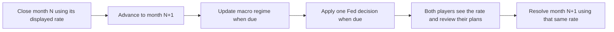

# Federal Funds and rate exposure

Implementation specification, September 26, 2026, incorporating the player's
approved fixed-investment and maturity refinement. New Expanded uses save 9.35
and `monetaryPolicyVersion:1`. Delivery status and measured evidence belong
in [release status](release-status.md); ordering belongs in [the roadmap](roadmap.md).

## The experience

The Fed announces a rate decision. Both banks face the same decision, but their
results depend on the business they have built. A bank with cheap, stable deposits
and short-term investments may benefit from a hike. A bank holding older fixed-rate
loans while paying more for deposits may lose margin. A cut reverses those pressures,
but guarantees, maturities and pricing floors prevent a perfectly symmetrical result.

The player should be able to answer three questions without opening several menus:

1. What rate applies this month, and when is the next decision?
2. Which parts of my bank reprice now, later, or only on new business?
3. What can I change, and what is the quoted cost of that change?

Start with **new Expanded campaigns**. Core and existing saves keep their economic
rules. The same design can later support a simpler Core treatment, but that is a
separate balance decision. No new optional-system checkbox or additional top-level
workspace is needed.

## Pre-implementation baseline

Reviewed portable: `48bfd47558fc706203c52b041ef8739245c2671a4e368f0df4206d47b936ba8f`.
At that checkpoint Core was 8.20 and Expanded was 9.34. The table below records
the audit that informed the implementation, not the new 9.35 behavior.

| Existing mechanism | Current behavior | Design implication |
| --- | --- | --- |
| [Macro regimes](../src/content/catalog.js), [selection](../src/engine/territories.js), [monthly transition](../src/engine/monthly.js) | Five regimes contain a rate plus demand, deposit-pressure and credit-risk factors. The regime changes every four completed months. | Make the Fed decision a distinct, gradual process; do not turn every regime change into an immediate multi-point rate jump. |
| [Deposits](../src/engine/deposits.js), [pricing](../src/engine/product-pricing.js) | Withdrawable products already use the benchmark, policy and product factors. Essential/rewards pricing has player adjustments. High-yield promotions can retain a quoted rate for six months. | Reuse the actual quotes and cohorts. A promotion's rate guarantee is different from a withdrawal lock. |
| [Term funding](../src/engine/term-funding.js) | Six-month locked deposits retain their coupon until release or renewal. | Show a maturity ladder; never rewrite a promised coupon following a Fed announcement. |
| [Credit cohorts](../src/engine/credit.js), [monthly accounting](../src/engine/accounting-adapter.js) | Expanded retains the rate booked on each loan cohort. New loans receive current terms. Core uses a different aggregate calculation. | Preserve fixed contracts. Existing Expanded loans do not all become floating loans. |
| [Securities income](../src/engine/accounting-adapter.js) | The old bank securities balance earns the benchmark annually, divided into monthly income. | Replace it in 9.35 with a reconciled liquid/fixed subledger. The player explicitly brought maturity timing and early-sale valuation into the first version. |
| [Emergency funding](../src/engine/operations.js), [deposit report](../src/engine/deposits.js), [funding message](../src/engine/competition.js) | Several paths assume 1% per month. Limits, repayment and distress rules already exist. | Replace the rate assumption consistently under a new rule boundary, retaining real liabilities, limits and repayments. |
| [Investment settlement](../src/engine/investment-campaign.js), [notes](../src/engine/investment-notes.js), [company credit](../src/engine/company-credit-strategy.js) | The benchmark already feeds some investment distributions, new note coupons and company credit quotes. | Include these consumers in the audit. Customer investment income is not automatically parent-bank revenue. |
| [Forecast preparation](../src/engine/operations.js), [income bridge](../src/engine/income-review.js) | Owner forecasts and reconciled interest-income components already exist. Operating forecasts use a reduced world with cycle zero. | Preserve opening debt and contract state on the copied treasury book. Explicit scenario rates reach securities and borrowing. Forecasts never advance the Fed calendar or maturity settlement. |

### Measured current-engine control

Two new campaigns used seed `federal-rate-audit`, covered starting staffing and
the current edition settings. Each retained its AI-selected plan, opening books
and all non-rate macro factors. Only the forecast's benchmark changed. These are
existing-engine forecasts, not results from the proposed Fed system or resolved turns.

| Edition / monthly measure | 3.25% | 3.75% | 4.25% |
| --- | ---: | ---: | ---: |
| Core net interest income | $68,650 | $73,146 | $77,641 |
| Core operating profit | $73,048 | $81,017 | $88,986 |
| Expanded net interest income | $79,004 | $82,879 | $86,783 |
| Expanded operating profit | −$6,174 | −$2,300 | $1,605 |

The opening securities balance was $13.9M in each case. In Expanded, the +50-basis-
point comparison increased securities interest by $5,791, new/remaining loan
interest by about $126 and deposit interest expense by $2,013. Its net interest
income rose about $3,904; rounded operating profit rose $3,905. This is one opening
case, not evidence that hikes help every bank. Core's profit change also contains
rate-sensitive income outside the net-interest subtotal; that subtotal must not
be presented as the entire profit change.

The reproducible diagnostic and JSON receipt are local, ignored evidence under
`game/reports/local/federal-funds-design-20260926/`. Forecasts left the source
campaigns, owner views and their saved random state unchanged.

## Fed terminology and game simplifications

The federal funds rate concerns overnight borrowing of reserve balances between
institutions. The FOMC sets a target range; policy changes influence other borrowing
rates, with different responses across short-term, floating-rate and longer-term
credit. [Federal Reserve: monetary-policy transmission](https://www.federalreserve.gov/monetarypolicy/monetary-policy-what-are-its-goals-how-does-it-work.htm).

Interest on reserve balances is a separate administered rate.
[Federal Reserve: reserve balances](https://www.federalreserve.gov/monetarypolicy/reserve-balances.htm).
Discount-window borrowing is also distinct and requires collateral; it is not an
unrestricted loan button at the federal funds rate.
[Federal Reserve: discount window](https://www.federalreserve.gov/monetarypolicy/discountrate.htm).

For Branch Wars, use a fictional target range and its **upper bound as the pricing
anchor**. For example, show `Fed target 3.50–3.75%`; explain the 3.75% anchor in the
rate details. This is not the observed effective federal funds rate, a live feed,
or an exact reproduction of the Fed's operating framework. Existing emergency
funding remains labeled **Emergency funding**, with a game-defined penalty spread.
Do not relabel it as the discount window.

## Proposed first playable rules

All numerical choices in this section are starting balance parameters, not real
financial forecasts. Commit them only after the controlled scenario trials below.

### Shared policy process

- One public monetary-policy state per campaign, authoritative on the host.
- Initial upper bound uses the opening regime's existing benchmark. The target
  range is 25 basis points wide; the upper bound is bounded to 25–1,000 basis points.
- Decisions occur at the opening of months 3, 5, 7 and so on. Month 1 displays the
  opening policy. This fictional two-month calendar is chosen for turn pacing.
- Meeting outcomes are hold, ±25 or ±50 basis points. The same published regime
  provides directional context to both players; the AI receives no future outcome.
- Regime changes still provide the existing macro demand/credit environment.
  Under the new rules, they no longer overwrite the policy anchor. Do not add a
  second generic demand or default penalty for the same regime in this first slice.
- At the floor/ceiling, clamp the proposed move and record the actual move. Never
  reroll until a preferred result appears. Store the last 12 actual decisions,
  including holds; do not manufacture a pre-campaign history.

Candidate meeting weights, for calibration only:

| Regime | Cut 50 bp | Cut 25 bp | Hold | Raise 25 bp | Raise 50 bp |
| --- | ---: | ---: | ---: | ---: | ---: |
| Expansion | 0% | 5% | 55% | 35% | 5% |
| Steady | 0% | 15% | 70% | 15% | 0% |
| Tight | 0% | 5% | 25% | 55% | 15% |
| Downturn | 15% | 55% | 30% | 0% | 0% |
| Recovery | 5% | 20% | 65% | 10% | 0% |

The existing scenario influences the regime sequence; do not apply a second
hidden scenario multiplier to these weights. Keep probabilities out of the main
Overview card. A short outlook such as “Upward pressure” conveys the context
without pretending the next decision is guaranteed.

### Contract and accounting treatment

| Exposure | First-slice rule | Player response |
| --- | --- | --- |
| Withdrawable, unprotected deposits | Existing product/policy formula and manual tariff, using the current policy anchor. Keep rate floors and cohort rounding. | Review actual product pricing and its retention/cost trade-off. |
| Promotional deposits | Retain their guaranteed coupon until expiry. They remain withdrawable unless separately locked. | Review upcoming promotional expiries. |
| Locked term deposits | Retain coupon until maturity. Renewals use the new quoted rate. | Offer/renew term funding through the existing funding policy. |
| Existing bank and company loans | Preserve booked fixed coupons and contract terms. | Review the portfolio's remaining term and new origination mix. |
| New ordinary loans | Keep existing product-specific quote formulas, substituting the policy anchor. This is not uniform one-for-one repricing. | Compare new-business yields, demand and staffed capacity. |
| Bank securities | Liquid holdings reprice each month. Fixed 6- and 24-month holdings retain their coupon, amortized cost and maturity. Their early-sale value follows a simplified discounted-cash-flow curve. | Choose Liquid, Balanced or Longer fixed in the Overview rate desk; compare coupon income separately from estimated sale value. |
| Emergency funding | Annual rate = policy anchor + 825 bp, divided by 12 for monthly accrual. At a 3.75% anchor this equals today's 12% simple annual / 1% monthly charge. | Use existing liquidity and repayment controls. Retain funding limits and resolution rules. |
| Customer investment distributions and new notes | Existing issuer-backed payout and quote rules consume the same current anchor. Existing fixed notes retain their coupon. | Show these in their own statements; only actual fees or attributable group earnings enter bank/group income. |
| Cash / reserve balances | Retain existing treatment. Cash is not automatically a segregated interest-earning Fed reserve account. | A genuine reserve-placement feature would require an explicit funded account and separate rules. |

The emergency spread is a calibration reference, not a claim about real Fed lending.
Adopt an explicit opening-balance accrual convention under the new rules: debt
already outstanding pays the month's charge; funding created during settlement
is carried into the next month's opening charge. This is a prospective timing
choice, not a claim that the current paths already observe debt at an identical
point in settlement. Test new borrowing and repayment separately. Do not introduce
an undocumented same-month fee or count debt principal as an expense.

Use integer annual basis points at the policy boundary. One basis point is 0.01
percentage point. Simple monthly interest is `principal × annualBp / 120000`.
Existing cohort rates use monthly millionths: convert via an explicit adapter and
retain their established rounding, rather than silently changing old contracts.
Display “annual rate,” not APY, when the figure is a simple annualized quote.

The monthly statement must reconcile:

`Net interest income = loan interest + bank securities interest − deposit interest − borrowing interest`.

Principal movements, client asset balances, new borrowing and securities sale
proceeds are not interest income. Sale losses, credit losses, fees and operating
costs remain separate statement lines. No duplicate legacy interest charge may
remain behind the new calculation.

## Turn timing, saves and multiplayer

The meeting cannot occur between two players' submissions. Leaving, recalling a
plan, refreshing, previewing or resuming a half-ready save cannot redraw policy.
Every transaction and forecast in a month must use the same effective rate.

Proposed schema is `monetaryPolicyVersion:1`, plus a campaign-owned record containing
the upper bound, effective cycle, next meeting cycle, last decision and bounded
history. Use one dedicated, validated random-stream state derived from the campaign
seed; keep it out of owner/public projections. Public projections contain the
current policy, actual history, outlook and next meeting date. Private loan/deposit
cohorts and private draft responses stay owner-only.

`economy.rate` may remain a compatibility projection of `upperBp / 100` for existing
consumers. It must not become a separately writable second source. Validate equality
on incoming views/saves. Old rule paths keep their original regime-rate behavior.

Register the rule, dependencies, peer capability, creation, migration validation,
public projection and rematch explicitly. Allocate the next save version at
implementation time. The checked next version is 9.35, requiring the complete
9.34 Expanded dependencies and `monetaryPolicySupported:1` on both peers.
Absent marker means old rules. Reject malformed or unsupported marked saves rather
than supplying missing policy history or recalculating a sealed turn. A compatible
new rematch retains the feature but initializes a fresh policy calendar.

## Interface: one rate desk, no nested dropdowns

**Overview** owns the Fed summary beside the existing economic conditions:

> Fed target: 3.50–3.75% · Raised 0.25 points · Applies this month  
> Next decision: Month 7 · Outlook: Upward pressure  
> Your rate exposure: deposits reprice sooner than existing loans  
> **Review rate impact**

“Review rate impact” expands one adjacent section in Overview. Its short table has
rows for loan interest, securities interest, deposit expense, borrowing expense and
net interest income, with **Current rate / Scenario / Difference** columns.
Visible buttons choose `−0.50 points`, `Current`, `+0.50 points` or `+1.00 point`.
These are hypothetical comparisons, never controls over the Fed or submitted orders.

Below the table, show the actual exposure amounts: deposits repricing now,
guarantees/terms expiring over the next six months, fixed loans retained, and any
borrowing. Use a short maturity table or bars; no disclosures inside disclosures.

Provide three plainly named contextual actions using the existing navigation and
return trail: **Edit deposit pricing**, **View lending portfolio**, and **Review
funding policy**. A Return action comes back to the same rate comparison with the
current shared draft. A scenario button cannot overwrite pricing, office work or
the staged announcement. Preserve the existing game palette and typography.

The last Fed decision also appears once in the round briefing, including a hold.
Keep staged bank announcements first, as already promised; the Fed item follows
them. Its text explicitly says the new rate applies to the newly opened month.
Tag it with that effective cycle so it is not mistaken for the rate used in the
just-completed operating statement. Continuing or reconnecting never republishes it.

### What the comparison means

Default to **Rate effect on the current book**, a pure, owner-only sensitivity
calculation. Hold balances, draft policy, servicing, credit state and other macro
factors constant. Include contractual resets/maturities at the modeled boundary;
exclude new customers, new loans, future Fed moves and speculative rival actions.
Derive both sides from the same snapshot. The production UI must read this engine
quote, not recreate interest formulas in JavaScript markup.

Keep the existing full monthly operating forecast alongside it with its own label.
It includes the staged plan's broader activity and may differ from the isolated
rate effect. A six-month renewal schedule is a constant-rate illustration, not a
promise of six known future rates or guaranteed cash balances. Never label a rate
effect as a guaranteed change in total profit.

Illustrative unit case, not a saved bank or a calibrated forecast: both banks hold
$22M in assets, funded by $20M deposits and $2M equity; each has $2M cash, $12M of
variable deposits and $8M of term deposits not maturing this month. A hypothetical
deposit pass-through of 60% is used only to demonstrate the mechanism. No new loans,
credit changes or borrowing are included.

| A +0.50-point move | Bank A: $18M fixed loans, $2M securities | Bank B: $4M fixed loans, $16M securities |
| --- | ---: | ---: |
| Existing loan interest change | $0/month | $0/month |
| Securities interest change | +$833/month | +$6,667/month |
| Deposit expense change | +$3,000/month | +$3,000/month |
| Net interest income change | **−$2,167/month** | **+$3,667/month** |

This shows why “rates up” cannot be an automatic profit penalty. The 60% example
must not replace actual product-specific quotes, floors or guarantees in the game.

## Delivery sequence and exit checks

| Step | Work | Evidence needed before moving on |
| --- | --- | --- |
| 1. Exposure quote and compact rate desk | Add one pure current-book comparison and the six-month contract schedule; connect Overview and the existing pricing/portfolio/funding destinations. | Hand-calculated fixtures reconcile to cents/dollars under declared rounding; pending drafts survive every return; previews do not mutate the bank or RNG; labels distinguish sensitivity from full operating profit. |
| 2. Shared Fed calendar | Add the marked campaign state, bounded meeting process, history and effective-month announcement. | Identical seed/inputs yield identical decisions; no redraw on resume/recall; both seats receive identical public policy; new/old peer refusal is explicit; old campaigns replay exactly. |
| 3. Connect accounting and contracts | Centralize emergency interest under the marker; thread policy through all existing bank, company and investment consumers. Retain fixed coupons and funded payout constraints. | Preview and settlement match at the same boundary; deposits and fixed notes retain guarantees; borrowing accrues once; parent/client income is separated; full balance sheets reconcile. |
| 4. AI and calibration | Use the same current-rate quotes, visible rival prices and six-month obligations when evaluating the existing pricing/funding choices. Compare against no-change and simple fixed-policy controls. | Rising, falling, hold and reversal paths cover diverse books. The AI does not inspect future random outcomes or private rival plans. Neither perpetual borrowing nor passive securities creates an unexplained dominant loop. |
| 5. Integrated verification | Register focused tests, rebuild the portable artifact and run the canonical gate against frozen final inputs. | Compatibility, strict saves, both editions, all three simulated transports, complete full-game financial checks, followed by actual browser/keyboard and two-computer play. Publication remains separately authorized. |

The first integration steps are development milestones, not separately enabled
half-features. Keep the new default off until policy, contracts, accounting and
forecasts agree. Shipping the first playable slice requires steps 1–5; a mockup or
an isolated positive forecast does not satisfy them.

Calibration matrix: each existing scenario, rising/falling/flat/reversal scripted
paths, low/high loan-to-deposit ratios, short/long remaining fixed loans, maturing
term funding, rate floors and emergency borrowing. Run deterministic short cases
first, then at least 12 fixed seeds per scenario for 36 months, retaining failures.
Compare Core only as an unchanged control. Track net interest income, total profit,
deposit runoff, credit losses, cash shortfalls, emergency debt, survival and loan/
deposit growth. Choose weights/spreads from those measured trade-offs, not from
the desired sign of a single rate change.

### Bank treasury in the first version

The owner-only treasury record reconciles exactly to the securities account.
Opening assets are unchanged: half of existing securities are liquid, one quarter
is a six-month ladder, and one quarter is a 24-month ladder. Six-month coupons
are the purchase-time anchor plus 25 bp; 24-month coupons add 75 bp. These are
game calibration spreads, not quotations for actual securities.

Liquid investments sell at par. Fixed investments pay monthly coupons; their
memo sale value discounts remaining coupons and principal at the current anchor
plus the corresponding term spread. This simplified curve does not model an
independently moving long-term yield. Book equity changes only upon a realized
gain or loss. Funding sells liquid assets first, then the earliest fixed
maturities. Dealer inventory purchases take only liquid bank securities at par,
so a fixed bond cannot evade its market loss through the customer-investment path.

After monthly activity, expiring fixed principal returns to cash at par with no
income. The bank invests cash above 15% of deposits plus current payables, only
when emergency debt is zero. These purchases use cash, never new debt or grants,
and begin earning next month. Liquid keeps new funds floating; Balanced targets
50% fixed, split equally between new six- and 24-month holdings; Longer fixed
targets 80% fixed, with three quarters of new fixed purchases in 24-month terms.
Switching to a lower fixed target does not cancel or sell existing contracts.

The compact Fed card opens one inline desk. Scenarios do not change instructions.
Policy choices have Review, Stage and Cancel; the staged instruction joins the
existing monthly plan. The six-month table shows existing investment maturities,
scheduled loan principal (assuming payment), and expiring deposit protections.
Customer investment accounts remain separate from bank-owned earning assets.

### Later rate-system depth

Floating-rate loans, player-set lending spreads, explicit reserve placements,
real federal-funds lending/borrowing, hedging, independently moving yield curves,
and additional lagged demand/default effects belong after
the first complete slice. Each needs funded positions or explicit contract data.
For future floating loans, store rate type, reset schedule, spread, floor/cap and
reset history; update cohort compaction, transfer and validation so different
contracts never merge. Never retrofit existing fixed loans into floating ones.

Trust services, credit cards and correspondent relationships remain on the broader
requested list. Their future rate exposure should use this same policy source,
while ownership and client assets retain their own accounting boundaries.
